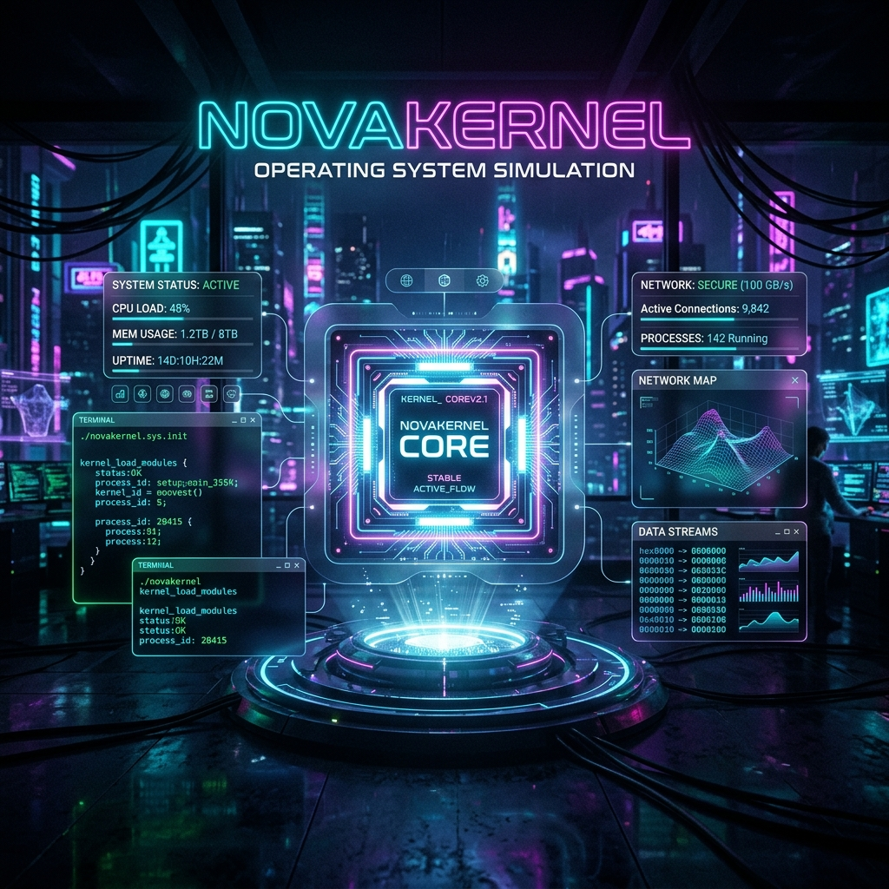

# 🌌 NovaKernel OS Simulation



> **"Experience the heartbeat of a modern kernel through a cinematic, high-fidelity simulation."**

NovaKernel is a premium, full-stack Operating System simulator designed to bridge the gap between abstract OS theory and real-time interactive visualization. It provides a "Mission Control" experience for monitoring process lifecycles, memory allocation, disk scheduling, and deadlock recovery.

---

## ✨ Key Features

- **Live System Telemetry**: Real-time bi-directional communication via WebSockets for instant state updates.
- **Dynamic Scheduling Visualization**: Interactive Gantt charts and process state transitions for various CPU algorithms.
- **Visual Memory Mapping**: Graphical heatmaps showing block-level memory allocation and fragmentation.
- **Disk Arm Animation**: Real-time visualization of disk head movement across tracks and sectors.
- **Deadlock Mission Control**: Intelligent detection with Bankers Algorithm and animated resource recovery timelines.
- **Functional Shell Terminal**: Integrated command-line interface to interact with the kernel directly.
- **High-Fidelity Dashboard**: Premium glassmorphic UI with smooth micro-animations and responsive layout.

---

## ⚡ Core Engine Modules

NovaKernel is powered by a modular Python-based kernel engine that simulates complex hardware interactions:

### 🧠 Memory Manager
- **Dynamic Allocation**: Real-time visualization of memory blocks.
- **Fragmentation Control**: Monitoring internal and external fragmentation.
- **Algorithm Support**: First-fit, Best-fit, and Worst-fit simulations.

### 🧵 Process & CPU Scheduler
- **Multilevel Queues**: Manage process states from `NEW` to `TERMINATED`.
- **Advanced Scheduling**: Interactive Gantt charts for FCFS, SJF, Priority, and Round Robin.
- **Context Switching**: Visualizing the overhead and precision of CPU cycles.

### 💿 Disk & I/O Observatory
- **Arm Movement Analysis**: Watch disk heads move in real-time across sectors.
- **Optimization Algorithms**: SCAN, C-SCAN, LOOK, and SSTF implementations.
- **Metric Tracking**: Seek time and throughput analytics.

### 🛡️ Deadlock Detection & Recovery
- **Resource Graphs**: Real-time dependency tracking between processes and resources.
- **Detection Engine**: Bankers Algorithm and Wait-for Graph analysis.
- **Automatic Recovery**: Intelligent victim selection and rollback mechanisms.

---

## 🛠️ Technology Stack

| Layer | Technologies |
| :--- | :--- |
| **Frontend** | React 18, Vite, Tailwind CSS, Framer Motion, Socket.IO |
| **Backend** | Python 3.10+, Flask, Flask-SocketIO |
| **Visualization** | Recharts, Custom Canvas Engines, CSS Glassmorphism |
| **Communication** | WebSocket (Bi-directional real-time telemetry) |

---

## 🚀 Getting Started

### 1. Clone & Setup
```bash
git clone https://github.com/ayesha-devx/NovaKernel-OS-Simulation.git
cd NovaKernel-OS-Simulation
```

### 2. Launch the Kernel (Backend)
```bash
cd backend
python -m venv venv
source venv/bin/activate  # Or `venv\Scripts\activate` on Windows
pip install -r requirements.txt
python app.py
```

### 3. Initialize the Observatory (Frontend)
```bash
cd ../frontend
npm install
npm run dev
```

---

## 🖥️ User Interface Overview

*   **Kernel Observatory**: The central hub for real-time telemetry.
*   **Mission Control**: Detailed control panels for every OS module.
*   **Holographic Terminal**: A fully functional command-line interface for manual system interaction.
*   **Cyberpunk HUD**: High-contrast, neon-glow interface optimized for professional presentations.

---

## 📜 License

Distributed under the MIT License. See `LICENSE` for more information.

---

<p align="center">
  Built with 💜 for Operating System Enthusiasts by Ayesha.
</p>
